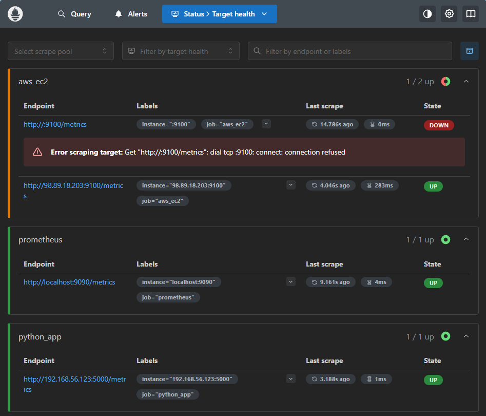

# Prometheus Basics

A hands-on demo repository covering core Prometheus concepts, from running it in a container to dynamic EC2 service discovery on AWS.

---

## What's Covered

| # | Topic | Description |
|---|-------|-------------|
| 1 | **Container Setup** | Run Prometheus via Docker Compose with a persistent volume |
| 2 | **Basic Configuration** | Static scrape targets with custom intervals (`prometheus.yml`) |
| 3 | **Python App Monitoring** | Flask app instrumented with `prometheus_client` (Counter metric) |
| 4 | **AWS EC2 Service Discovery** | Dynamic target discovery using `ec2_sd_configs` with IAM credentials |
---

## Repository Structure

```
prometheus-basics/
├── compose.yaml           # Docker Compose for running Prometheus
├── prometheus.yml         # Scrape config (static + EC2 service discovery)
├── app/
│   ├── app.py             # Flask app exposing /metrics endpoint
│   └── requirements.txt   # Python dependencies
└── iam_readonly_user      # IAM policy for EC2 read-only access
```

---

## Quick Start

### 1. Run Prometheus
We'll need to create an IAM user for the use of this demo with read only access to our ec2 instances so we will use the following commands:
```bash
aws iam create-user --user-name prom-user

aws iam attach-user-policy \
              --policy-arn arn:aws:iam::aws:policy/AmazonEC2ReadOnlyAccess \
              --user-name prom-user

 aws iam create-access-key \
              --user-name prom-user
```

Create an `aws_credentials.env` file with your AWS credentials (required for EC2 service discovery):

```env
AWS_ACCESS_KEY_ID=your_access_key
AWS_SECRET_ACCESS_KEY=your_secret_key
```

Then start Prometheus:

```bash
docker compose up -d
```

Prometheus will be available at **http://localhost:9090**

---

### 2. Run the Python App

```bash
cd app
pip install -r requirements.txt
python app.py
```

The app exposes:
- `GET /` — increments the `app_requests_total` counter
- `GET /metrics` — Prometheus-formatted metrics endpoint

---

## Scrape Configuration Overview

| Job | Target | Interval |
|-----|--------|----------|
| `prometheus` | `localhost:9090` | 15s (global) |
| `python_app` | `192.168.56.123:5000` | 5s |
| `aws_ec2` | EC2 instances (us-east-1, port 9100) | 40s |

> **Note:** The EC2 job uses `ec2_sd_configs` for dynamic discovery. AWS credentials are passed via environment file — acceptable for testing, not recommended for production.

---

## AWS EC2 Service Discovery

Prometheus discovers EC2 instances automatically using the public IP metadata label (`__meta_ec2_public_ip`) relabeled to scrape Node Exporter on port `9100`.

The IAM user requires read-only EC2 permissions. See `iam_readonly_user` for the required policy.

---

## Metrics Exposed

| Metric | Type | Description |
|--------|------|-------------|
| `app_requests_total` | Counter | Total number of HTTP requests to the Flask app |


## Final Results



---

## Prerequisites

- Docker & Docker Compose
- Python 3.x
- Node Exporter running on target EC2 instances (port 9100)